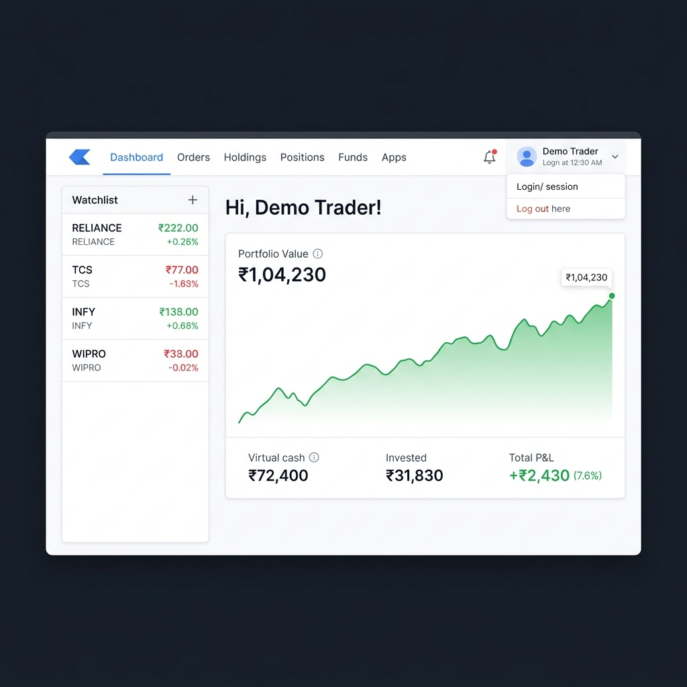

# MarketLab

[](https://github.com/UditSinghChauhan/MarketLab/actions/workflows/ci.yml)

A full-stack paper trading simulator built with the MERN stack. Users sign up, get a seeded virtual portfolio, and trade Indian equities in real time — with live price feeds, a complete order engine, and a live portfolio value chart.

> Market prices are simulated. Not affiliated with any real broker or exchange.



---

## Features

**Trading Engine**
- Market orders — instant BUY/SELL execution with cash and holdings validation
- Limit orders — queued as PENDING, auto-execute when the simulated price crosses the trigger
- Stop-loss orders — auto-execute a SELL when price falls to or below the stop price
- Cancel any pending order before it triggers

**Live Dashboard**
- Real-time market feed via Server-Sent Events (SSE) — single persistent connection, no polling
- Live portfolio value chart — 60-point rolling area chart, green when up, red when down
- Holdings page with portfolio allocation doughnut chart
- Positions, Funds, Orders pages with P&L colouring and status chips
- Price history modal (OHLC candlestick) for any watchlist symbol
- User-specific watchlist — add and remove symbols

**Backend**
- Hand-rolled authentication — PBKDF2 password hashing, HMAC-SHA256 signed session tokens
- Rate limiting on auth and order endpoints
- Global 401 interceptor — auto-clears session on token expiry
- Optional MongoDB persistence with zero-config in-memory fallback
- Demo reset — restores seeded portfolio, holdings, and watchlist

**Engineering**
- Backend integration test suite — 5 tests covering auth, orders, watchlist, reset, and limit/stop-loss flows
- GitHub Actions CI — runs tests on every push to `main`
- MongoDB indexes on `userId` for all query-heavy collections
- Clean conventional commit history

---

## Tech Stack

| Layer | Technology |
|---|---|
| Landing site | React, React Router |
| Dashboard | React, React Router, Chart.js, Axios |
| Backend | Node.js, Express |
| Database | MongoDB, Mongoose (optional) |
| Real-time | Server-Sent Events |
| Auth | PBKDF2 + HMAC-SHA256 (hand-rolled, no passport.js) |
| Testing | Node.js built-in test runner (integration tests) |
| CI | GitHub Actions |

---

## Project Structure

```
.
├── backend/      Express API, auth, order engine, market simulator
├── dashboard/    Trading dashboard (React)
├── frontend/     Public landing site (React)
├── docs/         Screenshots and assets
├── scripts/      Local utility scripts
└── .github/      CI workflow
```

---

## Getting Started

### Prerequisites

- Node.js 18+
- npm
- MongoDB (optional — the backend runs fully in memory without it)

### Install

```bash
npm run install:all
```

### Environment Variables

```bash
# Mac/Linux
cp backend/.env.example backend/.env
cp dashboard/.env.example dashboard/.env
cp frontend/.env.example frontend/.env

# Windows PowerShell
Copy-Item backend/.env.example backend/.env
Copy-Item dashboard/.env.example dashboard/.env
Copy-Item frontend/.env.example frontend/.env
```

Key variables:

```env
# backend/.env
PORT=3002
AUTH_SECRET=change-me-before-any-real-use
MONGO_URL=mongodb://localhost:27017/marketlab   # omit to use memory store

# dashboard/.env
REACT_APP_API_URL=http://localhost:3002

# frontend/.env
REACT_APP_DASHBOARD_URL=http://localhost:3001
```

### Run Locally

```bash
npm run start:backend    # http://localhost:3002
npm run start:dashboard  # http://localhost:3001
npm run start:frontend   # http://localhost:3000
```

**Demo credentials (pre-seeded on first login):**
```
Email:    demo@marketlab.app
Password: password123
```

---

## API Reference

| Method | Endpoint | Auth | Description |
|---|---|---|---|
| `GET` | `/health` | — | Health check |
| `POST` | `/auth/signup` | — | Register and receive session token |
| `POST` | `/auth/login` | — | Login and receive session token |
| `GET` | `/auth/me` | ✓ | Validate token, return current user |
| `GET` | `/account` | ✓ | Account balance and portfolio summary |
| `GET` | `/allHoldings` | ✓ | Current holdings with live P&L |
| `GET` | `/allPositions` | ✓ | Derived open positions |
| `GET` | `/allOrders` | ✓ | Full order history |
| `POST` | `/newOrder` | ✓ | Place market, limit, or stop-loss order |
| `DELETE` | `/orders/:id/cancel` | ✓ | Cancel a pending order |
| `GET` | `/watchlist` | ✓ | User watchlist with live prices |
| `POST` | `/watchlist` | ✓ | Add symbol to watchlist |
| `DELETE` | `/watchlist/:symbol` | ✓ | Remove symbol from watchlist |
| `GET` | `/market-feed` | — | Current simulated market snapshot |
| `GET` | `/market-stream` | — | SSE stream of market + index ticks |
| `GET` | `/indices` | — | Simulated index values |
| `GET` | `/history/:symbol` | — | Rolling OHLC price history |
| `GET` | `/portfolio-history` | ✓ | 60-point rolling portfolio value history |
| `POST` | `/demo/reset` | ✓ | Reset portfolio to seeded state |

---

## Testing

```bash
npm test --prefix backend
```

Runs 5 integration tests against the in-memory server (no database required):

| Test | What it covers |
|---|---|
| Auth flow | Signup, token validation, invalid token rejection |
| Market orders | BUY/SELL execution, cash deduction, realized P&L |
| Order validation | Insufficient cash and holdings rejection |
| Demo reset | Watchlist, orders, and holdings restored to seed |
| Limit/stop-loss | PENDING state, cancel, double-cancel rejection |

---

## Deployment

See [DEPLOYMENT.md](./DEPLOYMENT.md) for step-by-step instructions to deploy on Railway (backend) and Vercel (dashboard + landing site).

---

## Scripts

| Command | Description |
|---|---|
| `npm run install:all` | Install all dependencies |
| `npm run start:backend` | Start Express API (dev) |
| `npm run start:dashboard` | Start dashboard (dev) |
| `npm run start:frontend` | Start landing site (dev) |
| `npm run build` | Production build for dashboard and landing |
| `npm test --prefix backend` | Run integration tests |

---

## Implementation Notes

- The backend uses in-memory storage when `MONGO_URL` is not set — all data resets on restart.
- New users are seeded with 5 holdings and 7 orders for an immediate demo-ready experience.
- Market prices are generated by a local tick engine (sinusoidal drift + random noise, ±1.2% per tick, ±10% daily range).
- All three order types (market, limit, stop-loss) share the same evaluation engine — limit and stop-loss orders are evaluated every 4 seconds against the current simulated price.
- Portfolio value snapshots are recorded per user every 4 seconds and stored in a rolling 60-point buffer.
- Positions and portfolio totals are computed on-the-fly from account cash, holdings, and current prices — no stale derived data is stored.

---

## Limitations

- Prices are simulated — not suitable for real trading decisions.
- No partial fills, slippage, brokerage fees, taxes, or settlement simulation.
- Session tokens use a simplified HMAC scheme — harden before any production use.
- Frontend component tests are not yet included (see Roadmap).

---

## Roadmap

- [ ] Deploy to Railway + Vercel with live URL
- [ ] Frontend component tests (React Testing Library)
- [ ] Docker Compose for one-command local setup
- [ ] Brokerage fee simulation and trade export (CSV)
- [ ] Richer analytics — Sharpe ratio, max drawdown, sector breakdown

---

## License

For educational and portfolio use.
